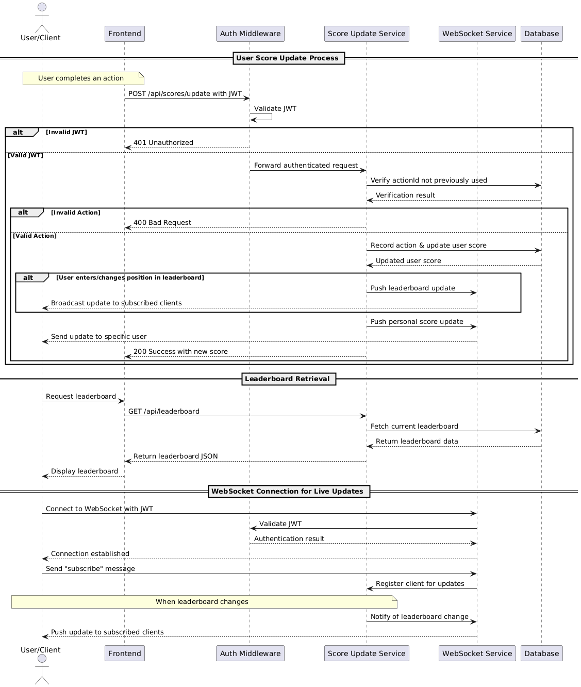

## Task
Write the specification for a software module on the API service (backend application server).

1. Create a documentation for this module on a README.md file.
2. Create a diagram to illustrate the flow of execution.
3. Add additional comments for improvement you may have in the documentation.
4. Your specification will be given to a backend engineering team to implement.

   Software Requirements
5. We have a website with a score board, which shows the top 10 user's scores.
6. We want live update of the score board.
7. User can do an action (which we do not need to care what the action is), completing this action will increase the user's score.
8. Upon completion the action will dispatch an API call to the application server to update the score.
9. We want to prevent malicious users from increasing scores without authorisation.

## Overview
This module provides backend functionality for maintaining and serving a real-time score board of user scores. It handles score updates, authentication, and delivers live score board data to clients.

## Key Features

- Secure score update endpoint
- Real-time scoreboard synchronization
- Protection against unauthorized score manipulation

### Components
1. **Authentication Middleware**: Validates user identity and permissions
2. **Score Update Service**: Processes and validates score update requests
3. **WebSocket Service**: Pushes real-time updates to connected clients

## Digram for overall flow 



## Score Update Flow
1. User completes action in frontend
2. Frontend sends update request with action ID and JWT
3. Backend validates JWT and action legitimacy
4. If valid, score is updated in database
5. WebSocket notifications are sent to connected clients


## Specification

### Authentication
- To validate user permission, prevent malicious users
- Use JWT 

### Web Socket for live update
- Sent to client when score board changes

Example resposne:
```json
{
  "type": "leaderboard.update",
  "data": {
    "updatedPositions": [
      {
        "userId": "string",
        "username": "string",
        "avatarUrl": "string",
        "score": number,
        "rank": number
      }
    ]
  }
}
```

- Sent to user when their score changes 

Example response:
```json
{
  "type": "user.scoreUpdate",
  "data": {
    "newScore": number,
    "leaderboardPosition": number,
    "change": number
  }
}
```

Client will subscribe to the server to recieve update when score board changes.


### API endpoints (can add more endpoints if needed)

- **POST /api/scores/update**

Updates a user's score after completing an action.

```
Authorization: Bearer {jwt_token}
```

Example request body:
```json
{
  "actionId": "string",    
  "actionType": "string"
}
```
The field `actionId` is responsible for the unique of the scorable-action from client. The server will check and verify the `actionId`, the score will only be updated if it passes all checks.

Example response body:
```json
{
  "success": boolean,
  "newScore": number,    
  "leaderboardPosition": number,  
  "message": "string"      
}
```

- **GET /api/leaderboard**

Retrieves the current leaderboard data.
No authorization is needed

Example response body:
```json
{
  "leaderboard": [
    {
      "userId": "string",
      "username": "string",
      "score": number,
      "rank": number
    }
  ],
  "userRank": {     // Only included if authenticated
    "rank": number,
    "score": number
  },
  "totalUsers": number,
  "lastUpdated": datetime
}
```


### Further enhancement
- Adding CAPCHA to avoid spammer
- Rate limiting to prevent abuse
- Logging mechanism 
- Caching system for the score board